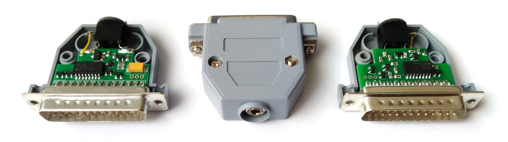

# Parallel Port Headphone DAC

This is a reasonably accurate replica of the early 1990s SoundJr device by SiliconSoft,
a port-powered parallel port DAC that can directly drive 32 ohm headphones.

A comprehensive list of the SoundJr's features can be found on [the manufacturer's website](http://siliconsoft.com/sndjr1.htm).
The drivers for the SoundJr can be found in the [VOGONS Vintage Driver Library](http://www.vogonsdrivers.com/).

## Pictures

## Audio output

The primitive R-2R DAC will continuously convert the 8-bit PCM sample on the parallel port's data lines.
A PC program can therefore play PCM data by periodically writing PCM samples to the parallel port's data port.

## Volume control

The device's output volume can be set to one of nominally eight levels via the control port bits of the PC's parallel port.
Note that some of these signals are active-low.
There is also an implicit energy saving mode that is active whenever no port pin provides power to the device.

Ctrl 3..0 | Volume level
:---------|:------------
0000      | undefined (weaker 8)
0001      | undefined (weaker 6)
0010      | undefined (weaker 7)
0011      | undefined (weaker 5)
0100      | 8
0101      | 6
0110      | 7
0111      | 5
1000      | undefined (weaker 4)
1001      | undefined (weaker 2)
1010      | undefined (weaker 3)
1011      | muted, if data 1..0 = 0
1100      | 4
1101      | 2
1110      | 3
1111      | 1

## Component Substitution

Since the availability and pricing of components can vary widely over the course of decades, some component substitution can become necessary.
The following substitutions have been tested successfully:

Original component              | Acceptable substitute           | Type of component
:-------------------------------|:--------------------------------|:------------------
DAN202K (ROHM Semiconductor)    | M1MA152WKT1G (ON Semiconductor) | Double diode
767163203G (CTS Corporation)    | 4816P-1-203LF (Bourns Inc.)     | Resistor pack
767163103G (CTS Corporation)    | 4816P-1-103LF (Bourns Inc.)     | Resistor pack
MMST2222A (ROHM Semiconductor)  | MSD601-RT1G (ON Semiconductor)  | NPN transistor
MMST2907A (ROHM Semiconductor)  | MSA1162GT1G (ON Semiconductor)  | PNP transistor

The value of the two filter capacitors is unknown, but 1nF capacitors appear to work well enough.
